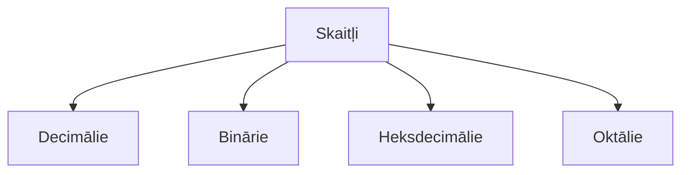

# Otrās nodarbības saturs:pushpin:

#### Nodarbības laikā apgūstamais saturs

1. :arrow_right:Uzstādīt IDE `Integrated Devolopment Envirement` Visual Studio code;
2. :arrow_right:Savienot `VSC` ar savu ***GitHub*** repozitoriju, modificēt repozitorija failus lokāli;
3. :arrow_right:Skaitļi;  

|krāsas|#RRGGBB|  
|------|-------|  
|melna|#000000|  

:fly:***Uzdevums:***  
Sameklēt sava vārda un uzvārda pirmos burtus ***`J Z`*** izteiksmi Binārā, Decimālā, Heksdecimālā un Oktālā izteiksmē.  
>:spiral_notepad: BIN = ;  
:spiral_notepad: DEC = ;  
:spiral_notepad: HEX = ;  
:spiral_notepad: OCT = ;

