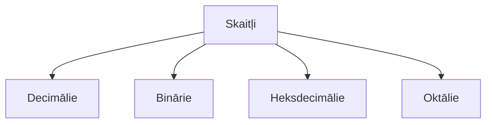

# Otrās nodarbības saturs:pushpin:

#### Nodarbības laikā apgūstamais saturs

1. :arrow_right:Uzstādīt IDE `Integrated Devolopment Envirement` Visual Studio code;
2. :arrow_right:Savienot `VSC` ar savu **GitHub** repozitoriju, modificēt repozitorija failus lokāli;
3. :arrow_right:Skaitļi;

| krāsas | #RRGGBB |
| ------ | ------- |
| melna  | #000000 |

**_Uzdevums:_**  
Sameklēt sava vārda un uzvārda pirmos burtus **_`J Z`_** izteiksmi Binārā, Decimālā, Heksdecimālā un Oktālā izteiksmē.  
:spiral_notepad: BIN = 01001010 01011010;  
:spiral_notepad: DEC = 74 90;  
:spiral_notepad: HEX = 4A 5A;  
:spiral_notepad: OCT = 112 132;

#### :floppy_disk: Skaitļu konvertēšana atšķirīgās skaitīšanas sistēmās ir aprakstīta [šeit](https://support.microsoft.com/lv-lv/office/skait%C4%BCu-konvert%C4%93%C5%A1ana-at%C5%A1%C4%B7ir%C4%ABg%C4%81s-skait%C4%AB%C5%A1anas-sist%C4%93m%C4%81s-880eeb52-6e90-4a9d-9e56-acaba6a27560)

#### Skaitļu sistēmas:

:spiral_notepad:Špikeri:[^1]  

  
  
[^1]: www.rapidtables.com

:fly: `Piezīmes`  
:floppy_disk: Visual studio code uzspiežot **F1**, izlec ātro taustiņu saraksts  
:floppy_disk: Komandrindas komanda **PWD** parāda vietu/mapi, kurā šobrīd atrodas lietotājs  
:floppy_disk: Ar **LS** komandu var saņemt informāciju par saturu, kas atrodas konkrētā mapē, jeb kas man ir pieejams  
:floppy_disk: **CTRL+L** notīrīt komandrindas ekrānu  
:floppy_disk: Nospiežot **LS -A** tiek attēlotas visi faili  
:floppy_disk: Nospiežot **LS -LA** detalizētāka informācija par failiem  
:floppy_disk: Lai noskaidrotu (komandrindā), vai konkrētajā vietā ir kāds dokuments ar mums vajadzīgajiem atslēgvārdiem, var izmantot šādu komandu `LS -LS *Teksts ko meklējam*`
