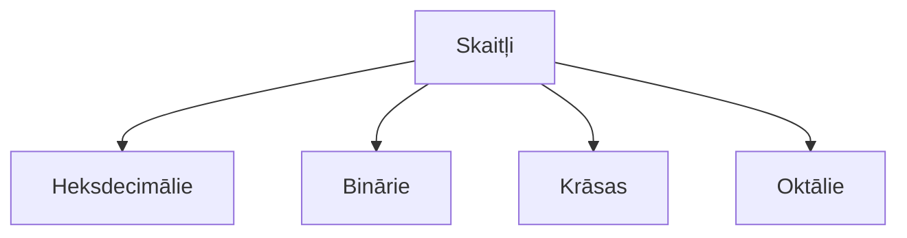

# Otrās nodarbības saturs

### Nodarbības laikā apgūstamais saturs:  

1. Uzstādīt IDE `Integrated Devolopment Envirement` - >Visual Studio code  
2. Savienot `VSC` ar savu **_*GitHub*_** repozitoriju - > modificēt repozitorija failus lokāli  
3. Skaitļi  

